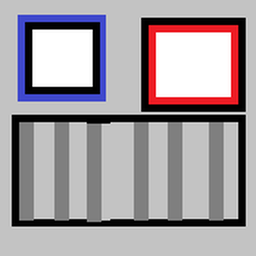

[![License][license-shield]][license-url] [![Stargazers][stars-shield]][stars-url]

	
	<h3 align="center">BEATBOB</h3>
	
 It's like Groovy but worse! 

## Dependencies
[![Discord.py][discordpy-shield]][discordpy-url] [![Youtube_DL][youtubedl-shield]][youtubedl-url] [![Spotipy][spotipy-shield]][spotipy-url]

(<a href="#top">back to top</a>)

## Getting started

(<a href="#top">back to top</a>)

<!-- General info shields and urls --> 
[license-shield]: https://img.shields.io/github/license/blondberg/beatbob?style=for-the-badge
[license-url]: https://github.com/blondberg/beatbob/beatbob/license
[stars-shield]: https://img.shields.io/github/stars/blondberg/beatbob?style=for-the-badge
[stars-url]: https://github.com/blondberg/beatbob/stargazers

<!-- Dependency urls and shields for the project --> 
[discordpy-shield]: https://img.shields.io/github/pipenv/locked/dependency-version/blondberg/beatbob/discord.py?style=for-the-badge
[discordpy-url]: https://pypi.org/project/discord.py/
[youtubedl-shield]: https://img.shields.io/github/pipenv/locked/dependency-version/blondberg/beatbob/youtube-dl?style=for-the-badge
[youtubedl-url]: https://pypi.org/project/youtube_dl/
[spotipy-shield]: https://img.shields.io/github/pipenv/locked/dependency-version/blondberg/beatbob/spotipy?style=for-the-badge
[spotipy-url]: https://pypi.org/project/spotipy/
